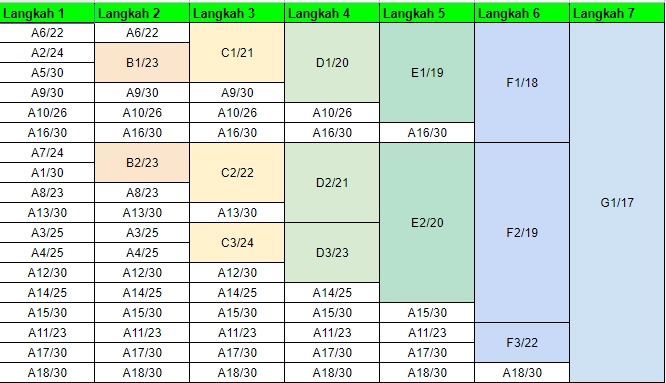

# Jarkom-Modul-4-F05-2022

## Kelompok F05

| Nama | NRP |
| ------------- | ------------- |
| Muhammad Amin | 5025201251 |
| Elthan Ramanda B | 5025201092 |
| Aiffah Kiysa Waafi | 5025201202 |

## Soal


<br>

### Catatan

1. Deadline hari Rabu, 24 November pukul 22.00
2. Soal shift dikerjakan pada Cisco Packet Tracer dan GNS3 menggunakan metode perhitungan CLASSLESS yang berbeda.
3. Bila di CPT menggunakan VLSM, maka di GNS3 menggunakan CIDR atau Sebaliknya
4. Jika tidak ada pemberitahuan revisi soal dari asisten, berarti semua soal BERSIFAT BENAR dan DAPAT DIKERJAKAN.
5. Untuk di GNS3 CLOUD merupakan NAT1 jangan sampai salah agar bisa terkoneksi internet.
6. Pembagian IP menggunakan Prefix IP yang telah ditentukan pada modul pengenalan
7. Pembagian IP dan routing harus SE-EFISIEN MUNGKIN.

### Hal yang perlu diperhatikan

1. Hasil perhitungan subnetting dan pohon pembagian IP serta file .pkt dikirim ke email asisten penguji 
2. File yang didemokan adalah file .pkt yang telah dikirim ke asisten.

### Pengurangan nilai akan dilakukan ketika:

1. Melanggar salah satu dari tulisan diatas.
2. Tidak menggunakan PREFIX ip yang ditetapkan sebelumnya
3. Hasil perhitungan untuk VLSM / CIDR, berbeda dengan di CPT / GNS3
4. Pembagian IP kurang efisien
5. Routing kurang efisien
6. Tidak bisa menjelaskan cara perhitungan VLSM dan CIDR

### Ralat: 

Tidak perlu menggunakan DHCP untuk pembagian IP pada GNS3

<br>

## Jawaban

Ada beberapa tahap yang perlu dilakukan dalam praktikum ini yaitu :
1. Labelling subnet
2. Subnetting 
	1. VLSM
	2. CIDR
3. Topologi
4. Konfigurasi

### Labelling

Pada tahap labelling, ada total 18 subnet. Kami memberikan A1 kepada subnet terjauh dari cloud.

#### Tabel Label

Berikut tabel yang tabel subnet / label :


<br>

Setelah selesai, didapatkan bahwa kita membutuhkan 2618 IP Addresses, sehingga NID root adalah

```
Network ID        : 10.31.0.0/20
Netmask           : 255.255.240.0
Broadcast Address : 10.31.15.255
Hosts             : 4094
```

#### Topologi dengan label

Berikut Topologi dengan label / subnet yang ditandai


<br>

### Subnetting

Setelah selesai menentukan berapa banyak subnet yaitu 18 subnet, serta menamai dari A1-A18 dan mendapatkan banyaknya IP yang dibutuhakan, selanjutnya lakukan pembagian nid subnet
#### VLSM

Karena tree terlalu besar, silahkan akses <a href="https://docs.google.com/spreadsheets/d/1Fi4FV33Nvimgh-x7T5VunAlKUVINWMHdP2yUx-4pypI/edit#gid=1119251696">disini untuk detail</a>

<br>
Maka, telah didapatkan tabel NID subnet dengan metode VLSM


<br>

#### VLSM-Optimation

Berbeda dengan VLSM di atas yang mana hanya mengambil NID paling kiri, VLSM dioptimasi mengambil berdasarkan subnet yang lebih besar seperti CIDR

Langkah pertama, kita hitung jumlah ip yang dibutuhkan pada masing masing router, berikut tabelnya :


<br>

setelah itu semua device (kecuali subnet router-router) totalnya ada 2604 + 7 hubungan antar router = 2618 IP

Netmask yang dipakai tetep /20, padahal pada tabel router terdapat 2 netmask /21, pada resonance bercabang 3, satu lagi ditaruh pada subnet yang masih ada cukup ip (pada vlsm kami ditaruh di bawah subnet The Instrument)

Nanti pada routing, bisa di-specify NID sehingga The Magical tetap dapat bisa diakses

Karena tree terlalu besar, silahkan akses <a href="https://docs.google.com/spreadsheets/d/1Fi4FV33Nvimgh-x7T5VunAlKUVINWMHdP2yUx-4pypI/edit#gid=1768378086">disini untuk detail</a>

<br>
Maka, telah didapatkan tabel NID subnet dengan metode VLSM yang dioptimasi


<br>

#### CIDR

Berikut tabel tiap langkah metode CIDR


<br>

Berikut visualisasi per langkah 

##### Langkah 1


<br>

##### Langkah 2


<br>

##### Langkah 3


<br>

##### Langkah 4


<br>

##### Langkah 5


<br>

##### Langkah 6


<br>

##### Langkah 7


<br>

Karena tree terlalu besar, silahkan akses <a href="https://docs.google.com/spreadsheets/d/1Fi4FV33Nvimgh-x7T5VunAlKUVINWMHdP2yUx-4pypI/edit#gid=116903094">disini untuk detail</a>

<br>
Maka, telah didapatkan tabel NID subnet dengan metode CIDR


<br>

### Konfigurasi

#### Cisco (VLSM)


<br>

Agar routing efisien dalam hal cara konfigurasi, pemilihan ip subnet telah dikelompokkan, sehingga saat konfigurasi, hanya perlu meng-add routing sebanyak router tetangga dan client

Routing ada 2 jenis yaitu :
- next hop
- exit interface

Jika ingin agar client yang terhubung dengan router dapat terhubung keluar, perlu ditambahkan routing exit interface

untuk menambahkan routing exit interface jika tidak bisa via GUI, jalankan command ini di CLI, pastikan sekarang berada di 

"Router(config)#ip route [NID] [Netmask] [interface]"
<br>
contoh : ip route 10.31.15.16 255.255.255.252 FastEthernet 0/1

- The Resonance
```
10.31.8.0/21 via 10.31.15.10
10.31.0.0/21 via 10.31.5.10
10.31.8.0/23 via 10.31.15.14
10.31.15.16/30 via FastEthernet0/1
```
- The Order
```
0.0.0.0/0 via 10.31.5.9
10.31.0.0/21 via 10.31.5.6
10.31.6.0/26 via FastEthernet0/1
```
- The Instrument
```
0.0.0.0/0 via 10.31.15.9
10.31.15.128/25 via FastEthernet0/1
10.31.10.0/24 via 10.31.15.2
10.31.12.0/22 via 10.31.15.6
```
- The Magical
```
0.0.0.0/0 via 10.31.15.13
```
- The Minister
```
0.0.0.0/0 via 10.31.15.5
10.31.15.20/30 via 10.31.14.3
10.31.14.0/24 via Ethernet0/3/0
10.31.12.0/23 via FastEthernet0/1
```
- The Dauntless
```
0.0.0.0/0 via 10.31.5.1
```
- The Profound
```
0.0.0.0/0 via 10.31.15.1
```
- The Firefist
```
0.0.0.0/0 via 10.31.15.5
10.31.8.0/22 via FastEthernet0/1
10.31.14.0/24 via Ethernet0/3/0
10.31.11.0/30 via 10.31.14.3
```
- The Queen
```
0.0.0.0/0 via 10.31.14.1
```

#### GNS3 (CIDR)

CIDR sudah efisien dalam hal subnetting, tetapi tidak efisien dalam hal range ip address yang digunakan dalam melakukan subnetting, yaitu perlu menggunakan netmask /17, padahal pada VLSM hanya butuh /20.
<br>
Hal itu bertujuan untuk memudahkan penambahan subnet baru pada jaringan komputer yang kita sudah buat

Berikut topologi :


<br>

HATI-HATI
- Setiap mengganti file /etc/network/interface atau network configuration, pastikan device di-restart
- Setelah melakukan routing, router jangan dimatikan, harus setup lagi jika mati
- Karena semua device ingin connect internet, maka jangan lupa ganti file /etc/resolv.conf

Jalankan perintah ini untuk menambah routing pada suatu router 
```
route add -net [NID] netmask [netmask] gw [next hop]
```
Contoh pada device resonance :
```
route add -net 10.31.0.0 netmask 255.255.192.0 gw 10.31.32.2
```

Jalankan perintah ini untuk melihat routing yang telah kita konfigurasi
```
ip route | grep "via"
```
- The Resonance
```
default via 192.168.122.1 dev eth0  metric 295 
10.31.0.0/18 via 10.31.32.2 dev eth4 
10.31.64.0/19 via 10.31.80.2 dev eth3 
10.31.96.0/19 via 10.31.98.2 dev eth2 
10.31.100.0/30 via 10.31.100.2 dev eth1 
```
- The Magical
```
default via 10.31.98.1 dev eth0
```
- The Instruments
```
default via 10.31.80.1 dev eth0 
10.31.64.0/21 via 10.31.68.2 dev eth2 
10.31.72.0/21 via 10.31.73.2 dev eth1 
10.31.76.0/25 via 10.31.76.2 dev eth3
```
- The Order
```
default via 10.31.32.1 dev eth0 
10.31.0.0/20 via 10.31.8.2 dev eth2 
10.31.16.0/26 via 10.31.16.2 dev eth1 
```
- The Minister
```
default via 10.31.8.1 dev eth0 
10.31.0.0/22 via 10.31.0.2 dev eth1 
10.31.4.0/22 via 10.31.5.2 dev eth2 
```
- The Dauntless
```
default via 10.31.5.1 dev eth0 
```
- The Profound
```
default via 10.31.73.1 dev eth0 
```
-The Firefist
```
default via 10.31.68.1 dev eth0 
10.31.64.0/23 via 10.31.64.3 dev eth2 
10.31.65.0/24 via 10.31.64.2 dev eth2 
10.31.66.0/23 via 10.31.66.2 dev eth1 
```
- The Queen
```
default via 10.31.64.1 dev eth0
```

Konfigurasi telah selesai dan semua device saling terhubung dan semua bisa mengakses internet


